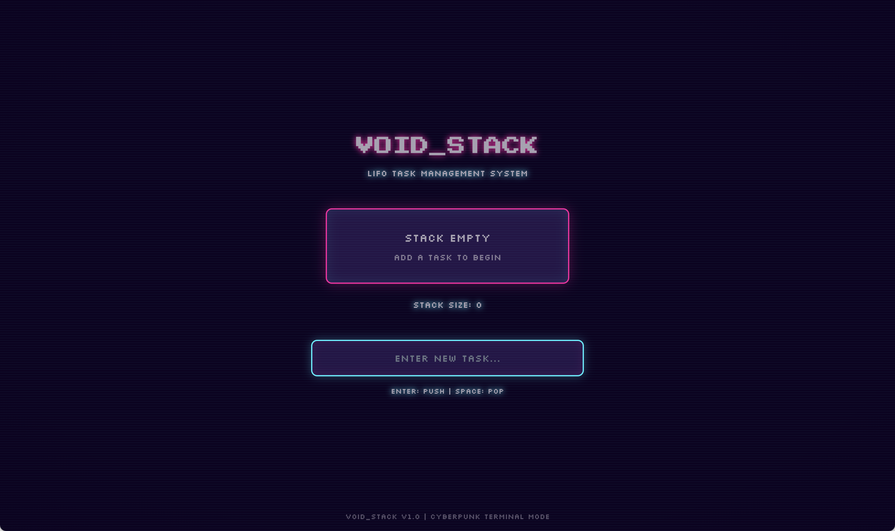
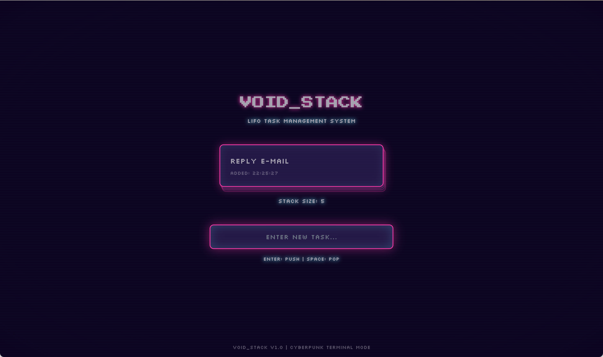

# voidStack

## 概要
**voidStack** は、レトロなサイバーパンク風UIで動作する「LIFO（スタック）型タスク管理」Webアプリです。

- タスクをスタック（LIFO）構造で管理
- キーボード操作で高速にタスク追加・削除
- ローカルストレージ保存でデータ永続化
- サイバーなCRT風デザイン

---

## スクリーンショット

### トップページ


### スタック操作画面


---

## 主な機能
- **LIFOスタック管理**：新しいタスクは一番上に積まれ、削除は一番上から（PUSH/POP操作）
- **キーボード操作**：
  - Enterキーでタスク追加
  - Spaceキーでタスク削除
- **レトロUI**：CRTモニター風のサイバーパンクデザイン
- **ローカルストレージ保存**：リロードしてもタスクが消えません

---

## セットアップ

1. リポジトリのクローン
```bash
git clone <このリポジトリのURL>
cd voidStack
```
2. 依存関係のインストール
```bash
pnpm install
```
3. 開発サーバーの起動
```bash
pnpm run dev --host
```
- ブラウザで `http://localhost:5173/` にアクセス

---

## 使用技術
- Vite
- React
- Tailwind CSS
- Radix UI
- その他（package.json参照）

---

## 作者
- [iwasamasaya](https://github.com/iwasamasaya)

## ライセンス
MIT 